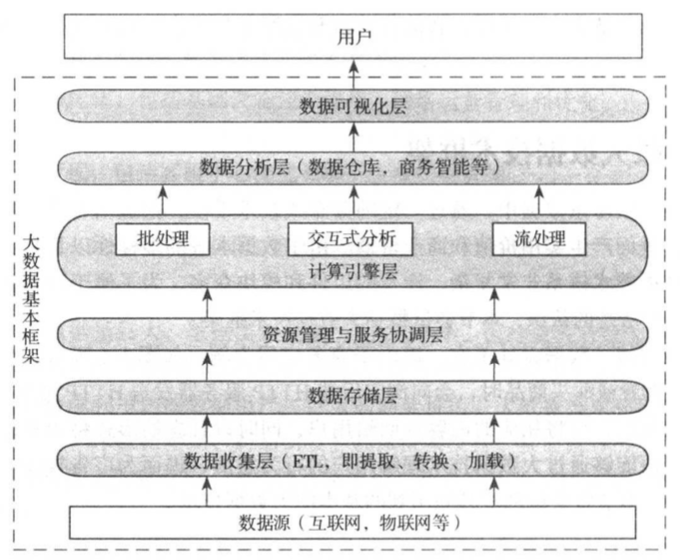

[TOC]

# bigdatainfra

企业级大数据技术架构：

  

### 数据收集层

数据源特点：  
> 分布式  
> 异构性  
> 多样化  
> 流式产生  

收集系统特点：  
> 扩展性  
> 可靠性  
> 安全性  
> 低延迟  

[数据收集层](./post/bigdatainfa01.md)

### 数据存储层

要求：  
> 扩展性  
> 容错性  
> 存储模型  

### 资源管理与服务协调层

引入资源统一管理层好处：  
> 资源利用率高  
> 运维成本低  
> 数据共享  

### 计算引擎层

按照对时间性能的要求，分为三类：  
> 批处理  
> 交互式处理  
> 实时处理  

### 数据分析层

### 数据可视化层