[TOC]

# 数据收集层

### 关系型数据的收集

#### 1. Sqoop（SQL on Hadoop）  
采用MapReduce进行全量关系型数据的收集。  
桥梁作用：  
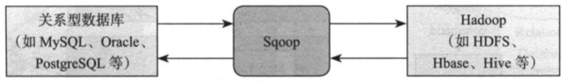  
Sqoop2基本架构：  
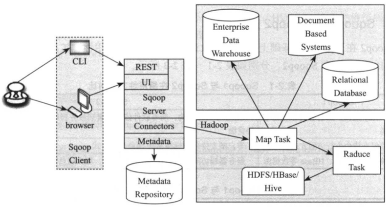  

如何高效地增量收集数据？CDC（Change Data Capture）！  

#### 2. Canal（阿里）Databus（LinkedIn）
Canal基本原理与架构  
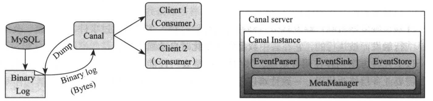  

为了解决多机房数据同步问题，Otter，基于Canal。  

#### 3. Otter
基本架构  
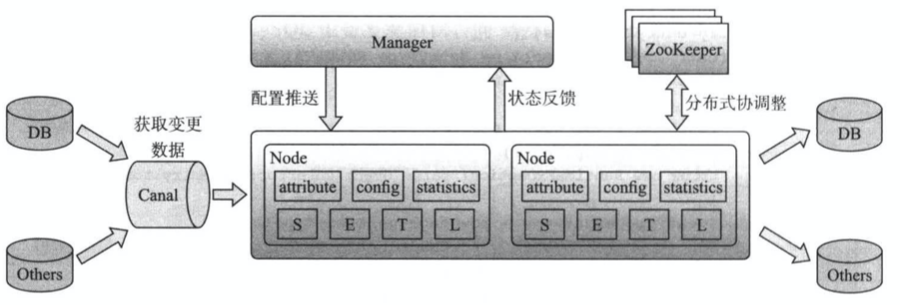  

#### 非关系型数据的收集

日志收集挑战：  
> 数据源种类繁多  
> 数据源是物理分布的  
> 流式的，不间断产生  
> 对可靠性有一定要求  

#### 1. Flume
JRuby构建，特点：  
> 良好的扩展性  
> 高度定制化  
> 声明式动态化配置  
> 语义路由  
> 良好的可靠性  

Flume NG（OG已经废弃）基本架构  
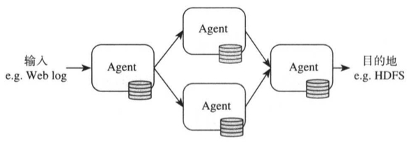  
Flume Agent基本构成  
  
Flume NG高级组件  
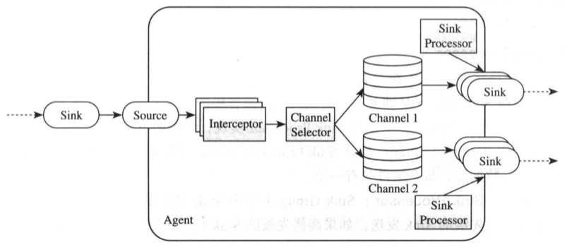  

#### 2. Fluentd
C/Ruby开发，架构设计和Flume如出一辙：  
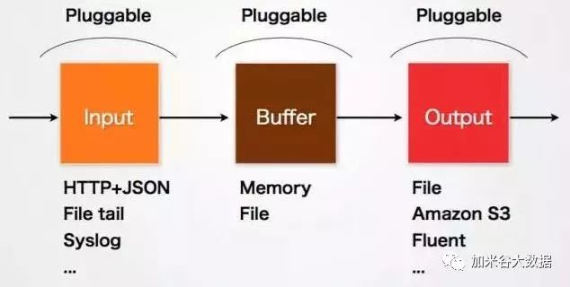  
Fluentd的Input/Buffer/Output对应Flume的Source/Chanel/Sink。  
  
Cool.io是基于`libev`的事件驱动框架。  

#### 3. Logstash
java开发，包括Input、Output、Filter：  
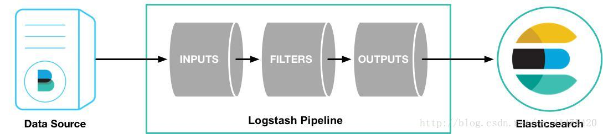  

> 「因为logstash是jvm跑的，资源消耗比较大，所以后来作者又用golang写了一个功能较少但是资源消耗也小的轻量级的logstash-forwarder。不过作者只是一个人，加入http://elastic.co公司以后，因为es公司本身还收购了另一个开源项目packetbeat，而这个项目专门就是用golang的，有整个团队，所以es公司干脆把logstash-forwarder的开发工作也合并到同一个golang团队来搞，于是新的项目就叫filebeat了。」  

#### 4. Filebeat/Beats
Filebeat从目前来讲有更常见的使用场景，它是用来替代Logstash Forwarder的下一代Logstash收集器，是为了更快速稳定轻量低耗地进行收集工作，它可以很方便地与Logstash还有直接与Elasticsearch进行对接。  
Beats架构：  
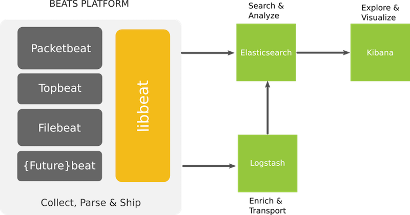  
Filebeat架构：  
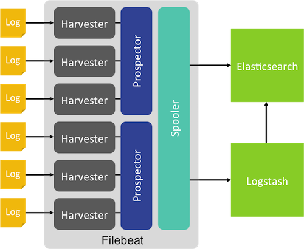  

#### Chukwa、Scribe废弃  

#### Splunk Forwarder商用

大多平台都抽象出了输入，输出和中间的缓冲的架构。利用分布式的网络连接，大多数平台都能实现一定程度的扩展性和高可靠性。  

#### 补充ELK推荐架构：  
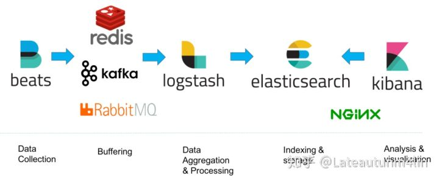  

### 参考
1. [你一定需要了解的六款大数据采集平台](https://cloud.tencent.com/developer/article/1142484)
2. [Beats 基础](http://soft.dog/2015/12/24/beats-basic/)
3. [logstash 和filebeat 是什么关系？](https://www.zhihu.com/question/54058964)
